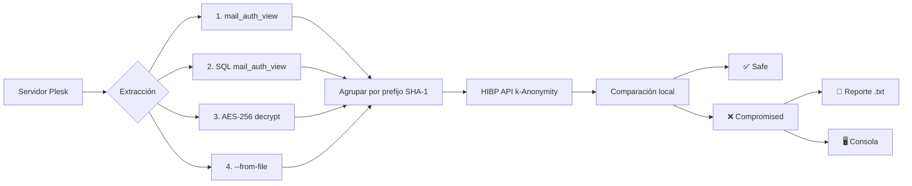

<div align="center">
  <h1>🛡️ Heimdall</h1>
  <p><strong>Plesk Email Password Auditor</strong></p>
  <p>
    
    
    
    
    
  </p>
  <p><em>Auditoría masiva de contraseñas Plesk contra HaveIBeenPwned · k-Anonymity · Zero-trust</em></p>
</div>

---

## 🔍 ¿Qué hace?

Heimdall extrae las contraseñas de correo de un servidor **Plesk** usando **4 métodos en cascada**, calcula el hash **SHA-1** de cada una y las coteja contra **HaveIBeenPwned** mediante **k-Anonymity** (solo envías 5 caracteres del hash, nunca la contraseña completa).

> ✅ Sin enviar contraseñas en claro · sin almacenamiento intermedio · optimizado por prefijo SHA-1

## ✨ Características

| Característica | Descripción |
|---|---|
| ⚡ **4 backends de extracción** | Binario → SQL → Desencriptación AES-256 → Archivo manual |
| ♻️ **Cascada automática** | Prueba todos los métodos hasta que uno funciona |
| 🔐 **k-Anonymity** | Nunca revelas el hash completo a HIBP |
| 📦 **Agrupación por prefijo** | 1 llamada API por prefijo SHA-1, no por contraseña |
| ⏱ **Rate limiting** | 1.5s entre peticiones — respeta los TOS de HIBP |
| 📄 **Reporte .txt** | Resumen legible con cuentas comprometidas |
| 🧵 **Cron-ready** | Diseñado para ejecución mensual desatendida |
| 🎨 **Colores en consola** | Salida formateada con semáforo visual |

## 📋 Extracción de datos

Heimdall intenta los siguientes métodos en orden. El primero que funciona se usa:

| # | Método | Requiere | Flag |
|---|---|---|---|
| 1 | `mail_auth_view` (binario) | Servidor Plesk con acceso al ejecutable | automático |
| 2 | SQL directo a `mail_auth_view` | Acceso MySQL + `.psa.shadow` | `--method sql` |
| 3 | Desencriptación AES-256-CBC | MySQL + `/etc/psa/private/secret` | `--method decrypt` |
| 4 | Archivo plano | Un `.txt` con `email:password` por línea | `--from-file cuentas.txt` |

### Backend 3 — Desencriptación manual

Para servidores donde `mail_auth_view` no existe pero tienes acceso a la BD y al archivo `secret` de Plesk:

```bash
heimdall.py --method decrypt
```

El algoritmo:
- Lee `/etc/psa/private/secret`
- Deriva clave AES-256: `SHA-256(secret)`
- Descifra cada password: `IV(16 bytes) + ciphertext` en hex desde tabla `mail`
- Requiere `pycryptodome` (`pip install pycryptodome`)

### Backend 4 — Archivo manual

Si no puedes ejecutar el script en el servidor Plesk, exporta las cuentas a un archivo:

```bash
# Formato: email:password (una por línea)
admin@dominio.com:MiPassword123
user@dominio.com:OtraPass456

# Ejecutar con:
heimdall.py --from-file cuentas.txt
heimdall.sh --from-file cuentas.txt
```

## 🚀 Instalación

```bash
git clone https://github.com/tu-usuario/heimdall.git /opt/heimdall
cd /opt/heimdall
```

### Opción A — Python (recomendada)

```bash
pip install -r requirements.txt
```

Dependencias adicionales para backends específicos:
```bash
# Para --method sql o decrypt
pip install mysql-connector-python

# Solo para --method decrypt (AES-256-CBC)
pip install pycryptodome
```

### Opción B — Shell (sin dependencias)

```bash
chmod +x heimdall.sh
# Solo necesita curl, openssl o sha1sum
```

## 🎯 Uso

### Automático (cascada)
```bash
python3 heimdall.py        # Prueba binary → sql → decrypt
./heimdall.sh              # Solo binary (o --from-file)
```

### Desde archivo plano
```bash
python3 heimdall.py --from-file cuentas.txt
./heimdall.sh --from-file cuentas.txt
```

### Forzar método específico
```bash
python3 heimdall.py --method sql
python3 heimdall.py --method decrypt
```

### Guardar reporte
```bash
python3 heimdall.py --txt /var/log/heimdall/reporte.txt
```

### Solo consola
```bash
python3 heimdall.py --dry-run
```

## 📅 Automatización (cron mensual)

```bash
sudo crontab -e
```

```cron
0 2 1 * * /opt/heimdall/heimdall.py --txt /var/log/heimdall/$(date +\%Y-\%m).txt
```

## 📄 Formato del reporte

```
============================================================
Heimdall - Reporte (2026-06-09 02:00:00)
============================================================

[!] 3 cuenta(s) COMPROMETIDA(S):

  - admin@example.com
    SHA-1: A94A8FE5CCB19BA61C4C0873D391E987982FBBD3
    Filtrada 1589x

Resumen: 47 auditadas | 3 comprometidas | 0 errores
```

## 🧠 Arquitectura



## ⚙️ Exit codes

| Código | Significado |
|---|---|
| `0` | Sin cuentas comprometidas |
| `1` | Error crítico |
| `2` | **Hay cuentas comprometidas** |
| `130` | Interrumpido (Ctrl+C) |

## 📦 Dependencias

### Python (`requirements.txt`)

```
requests>=2.28.0           # Consultas a HIBP
python-dotenv>=1.0.0       # Config opcional
```

Opcionales:
- `mysql-connector-python` — para backends SQL y decrypt
- `pycryptodome` — para backend decrypt (AES-256-CBC)

### Shell

| Comando | Propósito |
|---|---|
| `curl` | Peticiones HTTP a HIBP |
| `openssl` o `sha1sum` | Cálculo SHA-1 |

## 🔒 Seguridad

- **k-Anonymity**: solo 5/40 caracteres del hash viajan a HIBP
- **Zero storage**: contraseñas solo en memoria durante el hash
- **Sin logs sensibles**: nunca se escriben contraseñas en claro en logs ni reportes
- **Cascada segura**: si un método falla, pasa al siguiente sin dejar datos intermedios

---

<div align="center">
  <sub>Hecho con ❤️ para administradores Plesk que quieren dormir tranquilos.</sub>
</div>
