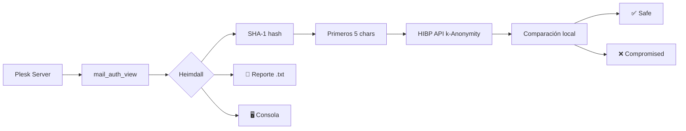

<div align="center">
  <h1>🛡️ Heimdall</h1>
  <p><strong>Plesk Email Password Auditor</strong></p>
  <p>
    
    
    
    
    
  </p>
  <p><em>Auditoría masiva de contraseñas Plesk contra HaveIBeenPwned · k-Anonymity · Zero-trust</em></p>
</div>

---

## 🔍 ¿Qué hace?

Heimdall extrae todas las cuentas de correo de un servidor **Plesk** mediante `mail_auth_view`, calcula el hash **SHA-1** de cada contraseña y las coteja contra la API de **HaveIBeenPwned** usando el protocolo **k-Anonymity** (nunca envías el hash completo, solo los primeros 5 caracteres).

> ✅ Sin enviar contraseñas en claro · sin almacenamiento intermedio · sin depender de BD MySQL

## ✨ Características

| Característica | Descripción |
|---|---|
| ⚡ **Sin dependencias externas** (Shell) | Usa `curl` + `openssl`/`sha1sum` — 0 librerías |
| 🐍 **Versión Python** | Para entornos con gestor de paquetes |
| 🔐 **k-Anonymity** | Nunca revelas el hash completo a HIBP |
| ⏱ **Rate limiting** | 1.5s entre peticiones — respeta los TOS de HIBP |
| 📄 **Reporte .txt** | Resumen legible con cuentas comprometidas y hashes |
| 🧵 **Cron-ready** | Diseñado para ejecución mensual desatendida |
| 🎨 **Colores en consola** | Salida formateada con semáforo visual |
| 🛡 **Graceful shutdown** | Responde a SIGINT/SIGTERM sin corromper datos |

## 📋 Requisitos

- **Servidor Plesk** (cualquier versión moderna con `mail_auth_view`)
- **Python 3.8+** (para `heimdall.py`) o **Bash 5.0+** (para `heimdall.sh`)
- **curl** y **openssl** o **sha1sum** (para la versión Shell)
- Conexión a Internet (puerto 443) para consultar la API de HIBP

## 🚀 Instalación

```bash
git clone https://github.com/tu-usuario/heimdall.git /opt/heimdall
cd /opt/heimdall
```

### Opción A — Python (recomendada)

```bash
pip install -r requirements.txt
```

### Opción B — Shell (sin dependencias)

```bash
chmod +x heimdall.sh
# ¡Ya está! Solo necesita curl y openssl
```

## 🎯 Uso

### Auditoría en vivo

```bash
# Python
python3 heimdall.py

# Shell
./heimdall.sh
```

### Guardar reporte

```bash
python3 heimdall.py --txt /var/log/heimdall/reporte.txt
./heimdall.sh --txt /var/log/heimdall/reporte.txt
```

### Solo consola (dry-run)

```bash
python3 heimdall.py --dry-run
./heimdall.sh --dry-run
```

### Modo verbose (debug)

```bash
python3 heimdall.py -v
```

## 📅 Automatización (cron mensual)

```bash
sudo crontab -e
```

Añade:

```cron
0 2 1 * * /opt/heimdall/heimdall.py --txt /var/log/heimdall/$(date +\%Y-\%m).txt
```

O con la versión Shell:

```cron
0 2 1 * * /opt/heimdall/heimdall.sh --txt /var/log/heimdall/$(date +\%Y-\%m).txt
```

> ℹ️ El primer día de cada mes a las 02:00 se ejecutará la auditoría y guardará un reporte con formato `YYYY-MM.txt`.

## 📄 Formato del reporte

```
============================================================
Heimdall - Reporte de auditoría (2026-06-09 02:00:00)
============================================================

[!] 3 cuenta(s) COMPROMETIDA(S):

  - admin@example.com
    Hash SHA-1: A94A8FE5CCB19BA61C4C0873D391E987982FBBD3
    Filtrada 1589 vez/veces

  - contacto@example.com
    Hash SHA-1: C8F3A2F0A94A8FE5CCB19BA61C4C0873D391E987
    Filtrada 247 vez/veces

Resumen: 47 auditadas | 3 comprometidas | 0 errores
```

## 🧠 Arquitectura



## ⚙️ Configuración

La versión Python admite un archivo `.env` en el mismo directorio:

```env
# Tiempo entre peticiones a la API de HIBP (segundos)
HIBP_RATE_LIMIT=1.5
```

La versión Shell se configura editando las variables al inicio del script:

```bash
readonly RATE_LIMIT=1.5
readonly HIBP_TIMEOUT=10
```

## 🧪 Exit codes

| Código | Significado |
|---|---|
| `0` | Auditoría completada — 0 cuentas comprometidas |
| `1` | Error crítico (no se encuentra `mail_auth_view`, fallo de red, etc.) |
| `2` | Auditoría completada — **se encontraron cuentas comprometidas** |
| `130` | Interrumpido por el usuario (Ctrl+C) |

## 🔒 Seguridad

- **k-Anonymity**: solo se envían 5/40 caracteres del hash SHA-1 — HIBP no puede reconstruir la contraseña original ni saber qué hash completo consultaste.
- **Zero storage**: las contraseñas solo viven en memoria durante el cálculo del hash.
- **Sin logs sensibles**: nunca se escriben contraseñas en claro en logs ni reportes.
- **Ejecución local**: el binario `mail_auth_view` corre exclusivamente en el servidor Plesk.

## 📦 Dependencias

### Python (`requirements.txt`)

```
requests>=2.28.0
python-dotenv>=1.0.0
```

### Shell

| Comando | Propósito |
|---|---|
| `curl` | Peticiones HTTP a HIBP |
| `openssl` o `sha1sum` | Cálculo de hash SHA-1 |
| `bash` (5.0+) | Ejecución del script |

## 🤝 Contribuir

1. Fork del repositorio
2. Crea una rama (`git checkout -b feature/mejora`)
3. Commit (`git commit -m 'feat: añadir X'`)
4. Push (`git push origin feature/mejora`)
5. Abre un Pull Request

## 📝 Licencia

MIT License — haz lo que quieras, pero si te sirve, una estrella ⭐ siempre se agradece.

---

<div align="center">
  <sub>Hecho con ❤️ para administradores Plesk que duermen tranquilos.</sub>
</div>
